# Annotation tool: full walkthrough

**Video (100 seconds):** [`figures/tool_demo.webm`](figures/tool_demo.webm). Open it in Chrome (drag the file into a tab).
The video and the screenshots below were recorded on Oct 5 on a scratch copy of a pack with throwaway usernames.
**The labels picked in them are demo clicks, not real annotations.**

The class uses the hosted copy at https://bluecart.khurramshafique.com (register once with a password; nothing to install).
The steps below are the same there. On Khurram's computer port 8000 is taken by another program, so use `-p 8001` locally.

## 1. Start the tool

In PowerShell:
```
wsl -d Ubuntu
```
Then in Ubuntu:
```
cd ~/workspace-school/bluecart/blue-cart-check
source .venv/bin/activate
cd annotation/packs/internal_01
potato start config.yaml -p 8000
```
Open http://localhost:8000 in Chrome. Stop the tool with Ctrl+C.

## 2. Label photos

| Step | What you do | What happens |
|---|---|---|
| Log in | Type your uniqname, press Start | No password. The same name later continues where you stopped |
| Welcome page | Read it once, press **Start labeling** | Explains the task and the two steps, and lists Group 2, the instructor and the teaching assistant. Shown only the first time |
| Read the rules | Look at "Flint blue-cart rules at a glance" on the right | Icon chips: the kinds Flint takes in the blue cart, and the kinds it never takes |
| Full rules | Click **Guidelines** (top right) | The full guidelines open in a new tab |
| Step 1: kind of item | Click a card or press its number: **1** blue cart item (blue bin), **2** never the blue cart (black bin), **3** can't tell (question mark) | The chosen card fills with its colour. Step 2 appears only after **1** |
| Step 2: state | Click a card or press **4** ready, **5** needs prep first, **6** ruined, **7** can't see enough | Only asked for blue cart items |
| Status line | Read the line above Step 1 | It says what to do next, then what your two answers mean, for example "Your answer: Accepted after prep" |
| Reason | Click one of the six icon chips | Optional |
| Next photo | Press **→** or click **Next** | Saved automatically. Blocked with a red message if a required step is unanswered |
| Go back | Press **←** or click **Previous** | Your earlier answers are still selected |
| Zoom | Hover over the photo, click **+ − ⟲** | Zoom in, zoom out, reset. Scroll inside the photo box to move around |
| Hint | Hover over an answer | One-line reminder of what it means |
| Jump to a photo | Answer the current photo, type a number in the **#** box, press Enter | Goes to that photo. It does not work while the current photo is unanswered |
| Jump to unlabeled | Click the double-arrow buttons | Goes to the previous / next photo you have not labeled |
| Key legend | Look under the questions, or click a key there | Three groups: Step 1, Step 2, Photos. A pressed key lights up here, in the help panel and on its card. Clicking a key does the same as pressing it (tablets). The Step 2 keys are grey, and shake red if pressed, until Step 1 is answered |
| Help | Click the round **?** button (bottom right), Escape closes it | How it works (the welcome page again), the tutorial video, the full guidelines, the demo page, the keys, and Khurram's email |
| Finish | Press → on the last photo | "Thank You" page. Answers can no longer be changed |

The four final labels are computed from the two answers (see guidelines Section 2). For example, blue cart item + ruined = `not_accepted`.

Progress card above the photo: **Labeled / Not labeled** is the status of the photo on screen (it changes the moment you answer), **N of M labeled** is how many photos you have labeled, **photo #** is your position in the list. Its buttons jump to the previous or next unlabeled photo or to a photo number. The top bar itself only shows the title and who is signed in.

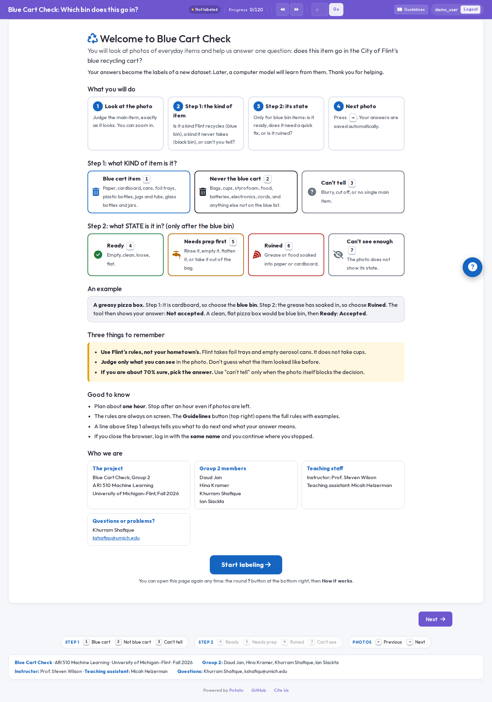

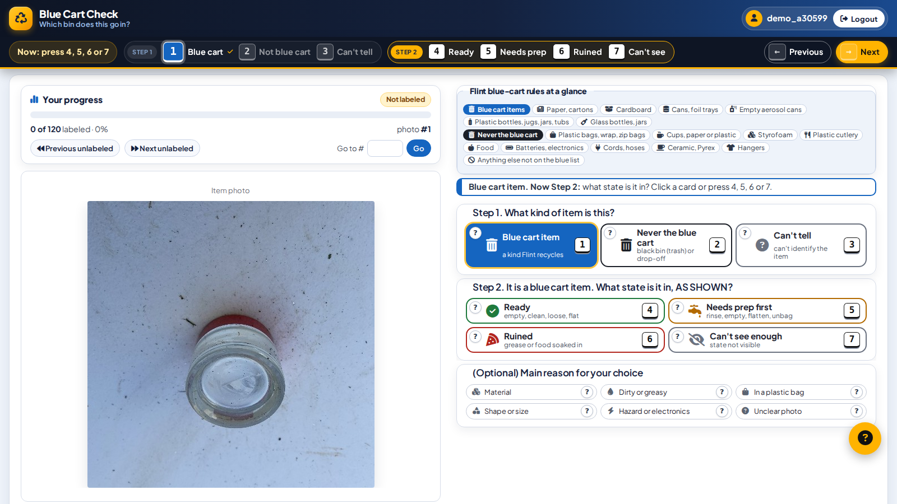
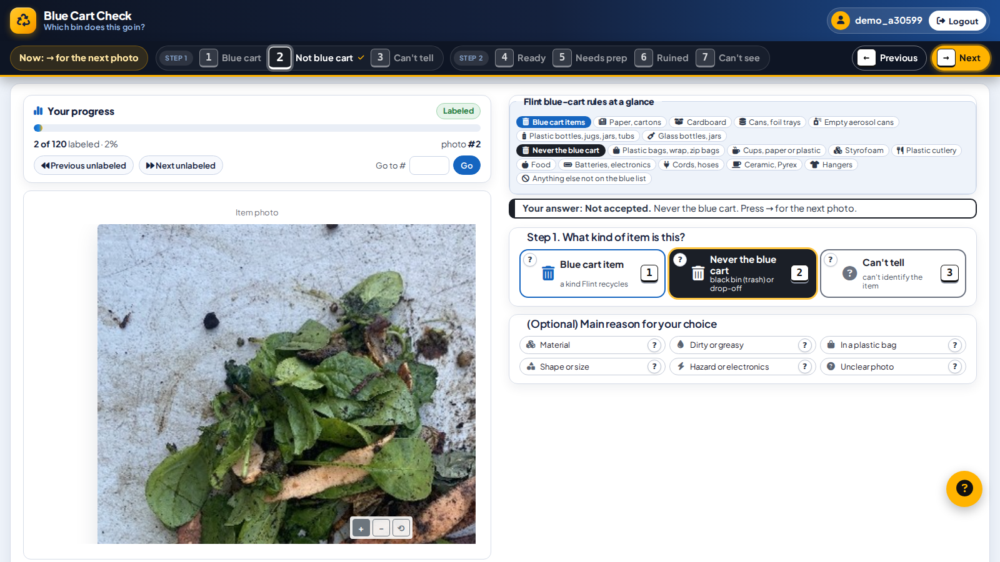
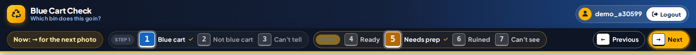
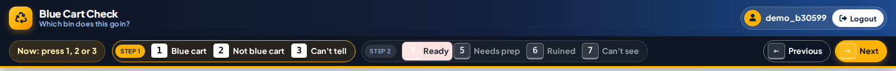
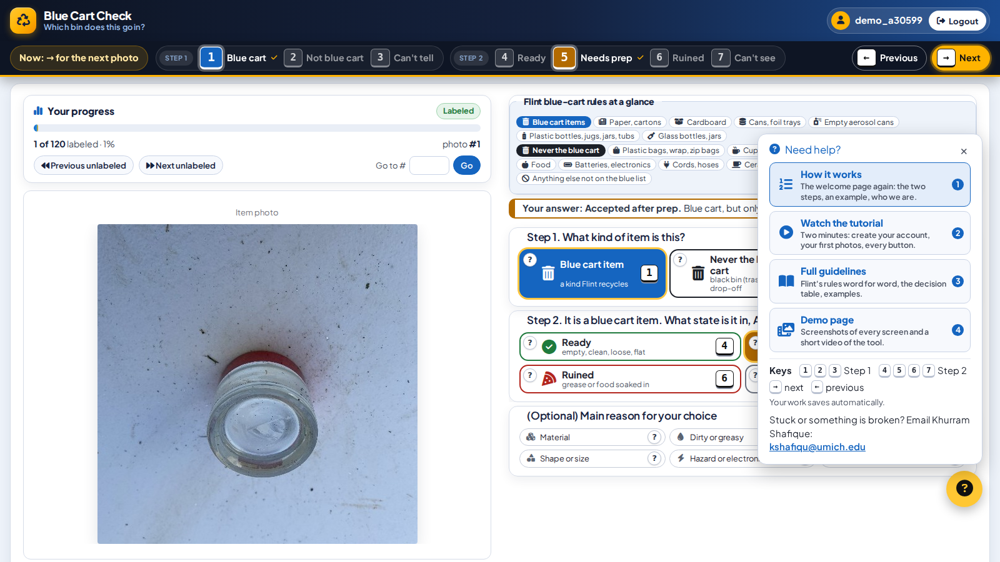
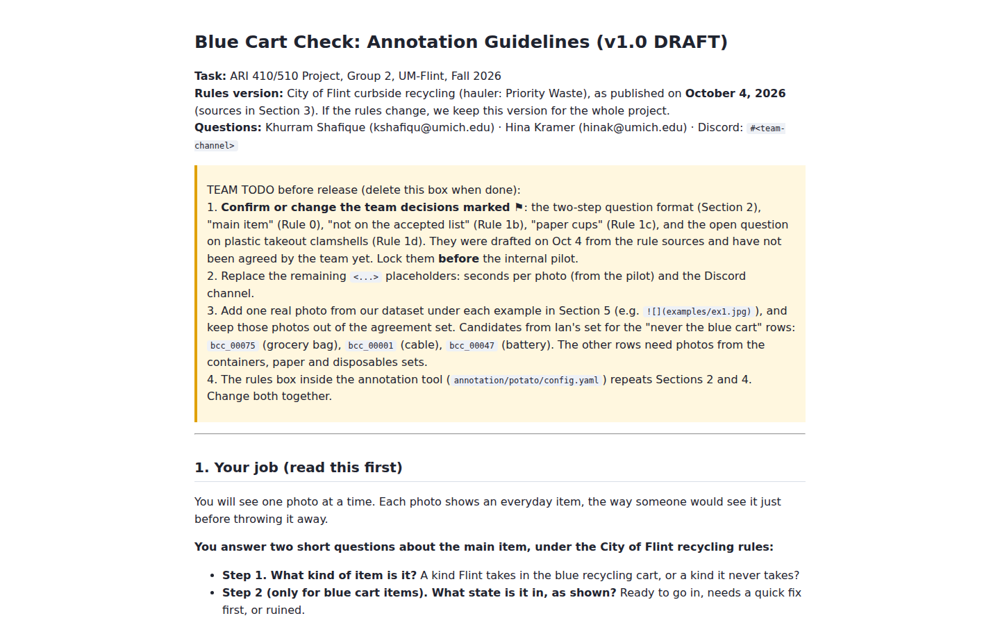

On a narrow window the same things stack vertically, questions first. On a short screen (small laptop) the cards become flatter, with the icon on the left:

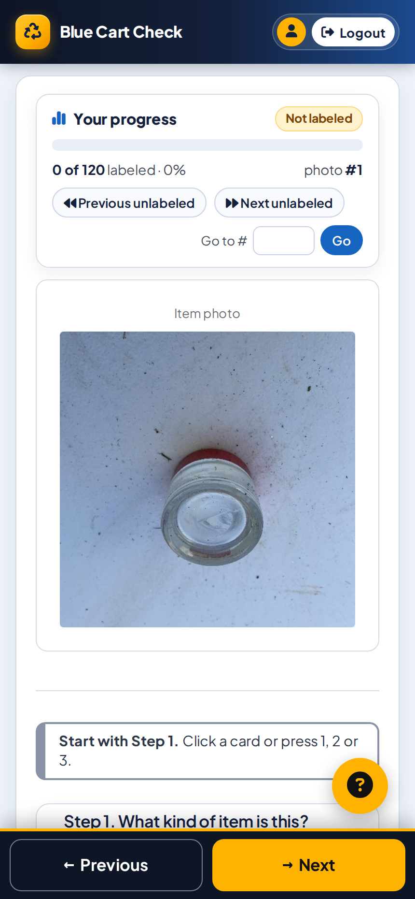

## 3. See the labels

### In the browser: the admin dashboard
1. Open https://bluecart.khurramshafique.com/admin (shared link) or http://localhost:8001/admin (local test copy) while the tool is running.
2. The first visit creates a key file, `admin_api_key.txt`, in the folder Potato was started from. Print it and paste its content into the box:
   ```
   cat deploy/local_server/admin_api_key.txt          # shared link
   cat annotation/packs/internal_01/admin_api_key.txt  # local test copy
   ```
   Each copy of the tool has its own key. The key is not stored anywhere else, so keep the file.
3. Tabs: **Annotators** (photos labeled per person), **Instances** (every photo, its labels, a disagreement score; sortable), **Questions** (how often each label was used).

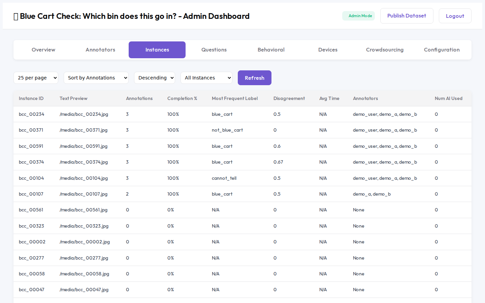
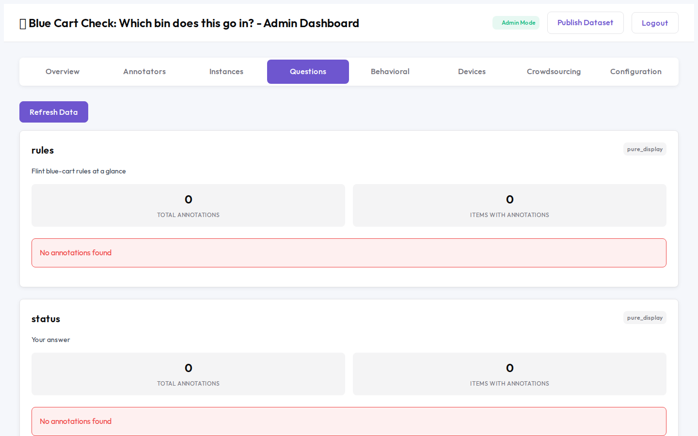

### In the terminal: a table and a photo review page
From the repo root, with the environment on:
```
python scripts/show_labels.py --returned annotation/packs/internal_01
```
It prints labels per annotator, how often each label was used, and one row per photo. It also writes:
- `labels_table.csv` (same table, for Excel)
- `labels_review.html` (every labeled photo next to its labels; a red border means annotators disagree)

Open the review page by pasting this into Chrome's address bar:
```
file://wsl.localhost/Ubuntu/home/kshafique/workspace-school/bluecart/blue-cart-check/annotation/packs/internal_01/labels_review.html
```

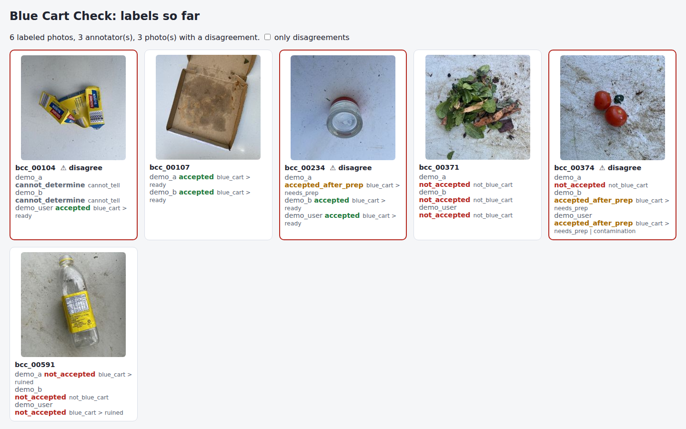

### Seconds per photo
```
python scripts/labeling_time.py --returned annotation/packs/internal_01
```

### The raw files
Everything an annotator sends back is in the `annotation_output` folder of their pack:

| File | What it is |
|---|---|
| `annotation_output/<username>/user_state.json` | Potato's own save file: every label, plus a log of every click with timestamps |
| `annotation_output/exports/jsonl/annotations.jsonl` | One line per labeled photo per annotator |

For the real pilot and for classmates' packs, copy each returned `annotation_output` to `annotation/returned/<annotator>/annotation_output/`. Then the three scripts above work without `--returned`, and `python scripts/compute_agreement.py` gives agreement and majority labels (Phase 2).
